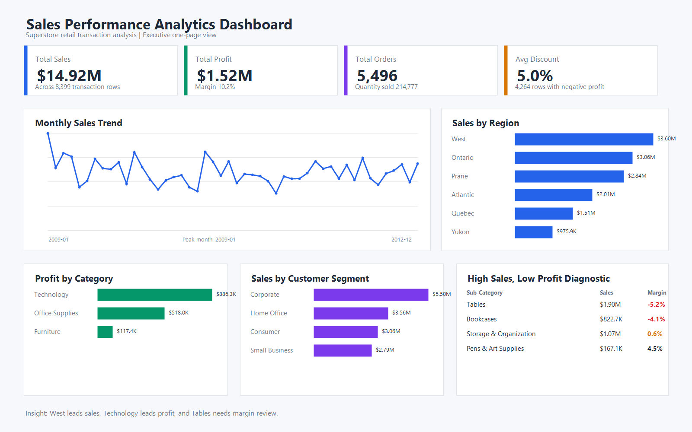

# Sales Performance Analytics Dashboard



## Business Problem

This project analyzes retail sales performance for a Superstore-style business. The goal is to understand sales performance, profit quality, regional contribution, product profitability, and customer segment behavior from transactional order data.

The project is designed as an entry-level Data Analyst portfolio case study with reproducible data cleaning, SQL analysis queries, summary outputs, a dashboard image, and business recommendations.

The main dashboard is now a static browser-based report that can be opened directly on macOS without Power BI Desktop, npm, or a local server.

Live demo: [sales-performance-dashboard-mauve.vercel.app](https://sales-performance-dashboard-mauve.vercel.app/)

## Business Questions

- What are total sales, total profit, profit margin, total orders, and quantity sold?
- Which regions and customer segments contribute the most sales?
- Which product categories and sub-categories are most profitable?
- Which high-sales sub-categories have weak or negative margins?
- How do monthly sales and profit change over time?

## Dataset

- Source: [Superstore Sales CSV](https://raw.githubusercontent.com/curran/data/gh-pages/superstoreSales/superstoreSales.csv)
- Rows analyzed: 8,399
- Unique orders: 5,496
- Key fields: `Order Date`, `Region`, `Product Category`, `Product Sub-Category`, `Sales`, `Profit`, `Order Quantity`, `Discount`, `Customer Segment`

The raw dataset is stored in `data/superstore_raw.csv`. The cleaned dataset is stored in `data/superstore_cleaned.csv`.

Field definitions and usage notes are documented in `data_dictionary.md`.

## Tools

- PowerShell for data cleaning, aggregation, and dashboard image generation
- HTML/CSS/JavaScript for the browser-based analytics dashboard
- CSV summary outputs for regional, category, segment, and monthly analysis
- SQLite analysis queries for KPI, trend, region, product, customer segment, and margin-risk analysis
- Optional Power BI build guide and DAX measures for users who want to recreate the report in Power BI Desktop
- GitHub project structure with reproducible analysis outputs

## Data Cleaning Steps

- Standardized order and ship date fields into `yyyy-MM-dd` format.
- Created `Year`, `Month`, and `YearMonth` fields for time-based analysis.
- Converted sales, profit, quantity, discount, unit price, and shipping cost fields into numeric values.
- Calculated row-level `ProfitMargin` as `Profit / Sales`.
- Exported a cleaned CSV and reusable summary tables for analysis and dashboard reporting.

## Analysis Approach

- Used PowerShell to clean the raw data, calculate derived fields, and generate analysis-ready CSV outputs.
- Used CSV summaries and SQLite queries to validate KPIs and answer the main business questions.
- Built a static browser dashboard to communicate the most important findings in an executive-style format.

## Dashboard KPIs

Open `dashboard/index.html` in a browser to view the Mac-friendly dashboard.

| Metric | Value |
| --- | ---: |
| Total Sales | $14.92M |
| Total Profit | $1.52M |
| Profit Margin | 10.2% |
| Total Orders | 5,496 |
| Quantity Sold | 214,777 |
| Average Discount | 5.0% |

## Key Findings

1. The West region generated the highest sales at $3.60M, followed by Ontario and Prairie.
2. Technology was the most profitable product category, contributing $886.3K in profit.
3. Corporate customers were the largest revenue segment, generating $5.50M in sales.
4. Tables had $1.90M in sales but a -5.2% profit margin, making it a high-sales, low-profit risk area.
5. 4,264 transaction rows had negative profit, showing that revenue growth alone does not guarantee healthy margins.

## Business Recommendations

1. Review pricing, discounting, and shipping cost drivers for high-sales, low-margin sub-categories such as Tables and Bookcases.
2. Use the West region as a performance benchmark and compare sales mix, customer segment concentration, and product category strategy across other regions.
3. Track profit margin alongside sales in reporting so discount-driven growth does not hide profitability problems.

## Limitations

- The dataset is historical and does not include marketing spend, inventory, customer acquisition cost, or return data.
- The browser dashboard is static and uses precomputed summary outputs generated from the cleaned dataset.
- A `.pbix` file is not included in this version; Power BI materials are optional recreation notes only.
- Profit drivers are inferred from available fields such as discount, shipping cost, category, and sub-category.

## Next Steps

- Add interactive filters if this project is expanded into a framework-based web app.
- Recreate the dashboard in Power BI Desktop as an optional extension using the provided cleaned dataset, DAX measures, and build guide.
- Expand the analysis with discount and shipping cost impact by category and region.

## Project Structure

```text
.
|-- analysis/
|   |-- analysis_notes.md
|   |-- category_profitability.csv
|   |-- high_sales_low_profit_subcategories.csv
|   |-- monthly_sales_profit.csv
|   |-- region_performance.csv
|   |-- segment_contribution.csv
|   |-- subcategory_performance.csv
|   `-- summary_metrics.json
|-- assets/
|   `-- sales_performance_dashboard.png
|-- dashboard/
|   |-- dashboard-data.js
|   |-- dashboard.css
|   |-- index.html
|   |-- powerbi_build_guide.md
|   `-- powerbi_measures.dax
|-- data/
|   |-- superstore_cleaned.csv
|   `-- superstore_raw.csv
|-- data_dictionary.md
|-- sql/
|   |-- 01_create_tables.sql
|   |-- 02_sales_kpis.sql
|   |-- 03_monthly_trends.sql
|   |-- 04_region_analysis.sql
|   |-- 05_product_profitability.sql
|   |-- 06_customer_segment_analysis.sql
|   |-- 07_high_sales_low_profit.sql
|   |-- README.md
|   `-- run_sqlite_analysis.ps1
|-- scripts/
|   |-- build_dashboard.ps1
|   `-- validate_dashboard.mjs
|-- index.html
`-- README.md
```

## How to Reproduce

Run the build script from the project root:

```powershell
powershell -ExecutionPolicy Bypass -File scripts\build_dashboard.ps1
```

The script regenerates:

- `data/superstore_cleaned.csv`
- all CSV summaries in `analysis/`
- `analysis/summary_metrics.json`
- `assets/sales_performance_dashboard.png`

Open the browser dashboard directly:

```text
index.html
```

The root page redirects to `dashboard/index.html`, which keeps the dashboard folder organized while giving deployed sites a simple home URL.

For a localhost preview, run:

```bash
python3 -m http.server 8765 --bind 127.0.0.1
```

Then open:

```text
http://127.0.0.1:8765/
```

Validate the dashboard data and documentation checks:

```bash
node scripts/validate_dashboard.mjs
```

## SQL Analysis

The `sql/` folder contains SQLite queries that reproduce the main business questions behind the dashboard: KPI performance, monthly trends, regional performance, product profitability, customer segment contribution, and margin-risk analysis.

These SQL files are included as an analysis layer for portfolio readability and reproducibility. They are not part of a database-backed application.

## Optional Power BI Implementation Notes

The repository includes a cleaned dataset, DAX measures, and a build guide that can be used to recreate the dashboard in Power BI Desktop. This is optional and not required for the current browser-based version. A `.pbix` file is not included in this version.

Import `data/superstore_cleaned.csv` into Power BI and create the measures from `dashboard/powerbi_measures.dax`. Use the layout guidance in `dashboard/powerbi_build_guide.md` to recreate the one-page dashboard.

## Resume Bullet Points

- Built a browser-based sales performance analytics dashboard analyzing 8,399 retail transaction rows to track revenue, profit, margin, regional performance, and customer segment contribution.
- Cleaned and aggregated Superstore sales data into reusable summary tables for monthly trends, regional performance, product profitability, and customer segment analysis.
- Identified high-sales but low-profit sub-categories such as Tables and Bookcases, generating business recommendations for pricing, discount, and margin review.
